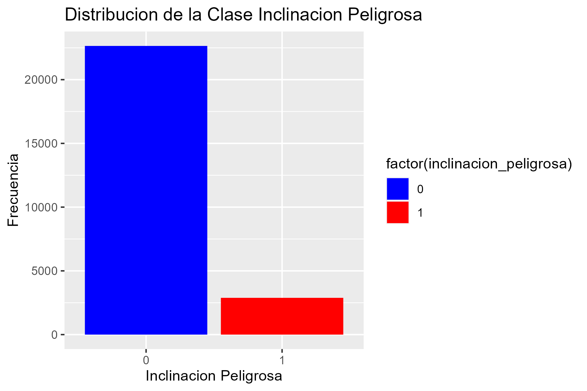
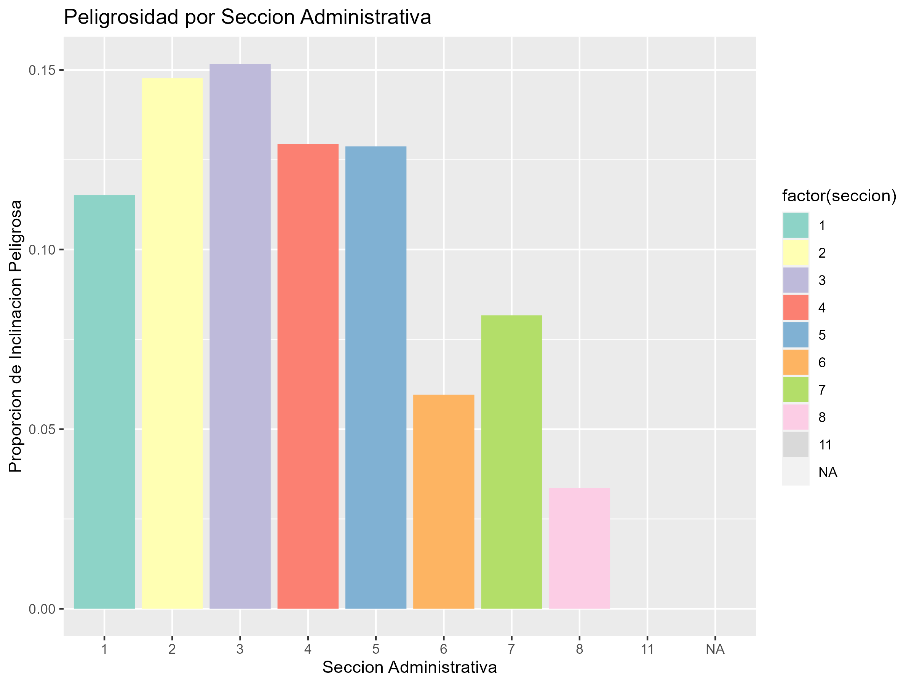
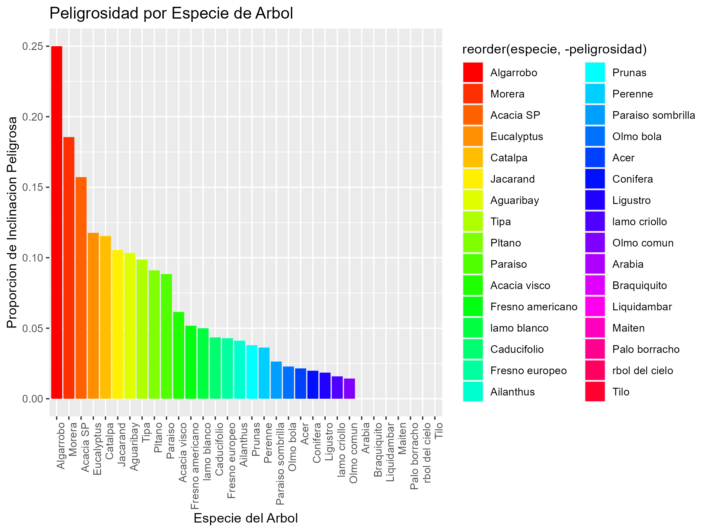

### Ejercicio 2
A partir del archivo arbolado-mendoza-dataset-train.csv responder las siguientes preguntas:

1. ¿Cuál es la distribución de la clase inclinacion_peligrosa?

    

2. ¿Se puede considerar alguna sección más peligrosa que otra?

    

3. ¿Se puede considerar alguna especie más peligrosa que otra?

    

