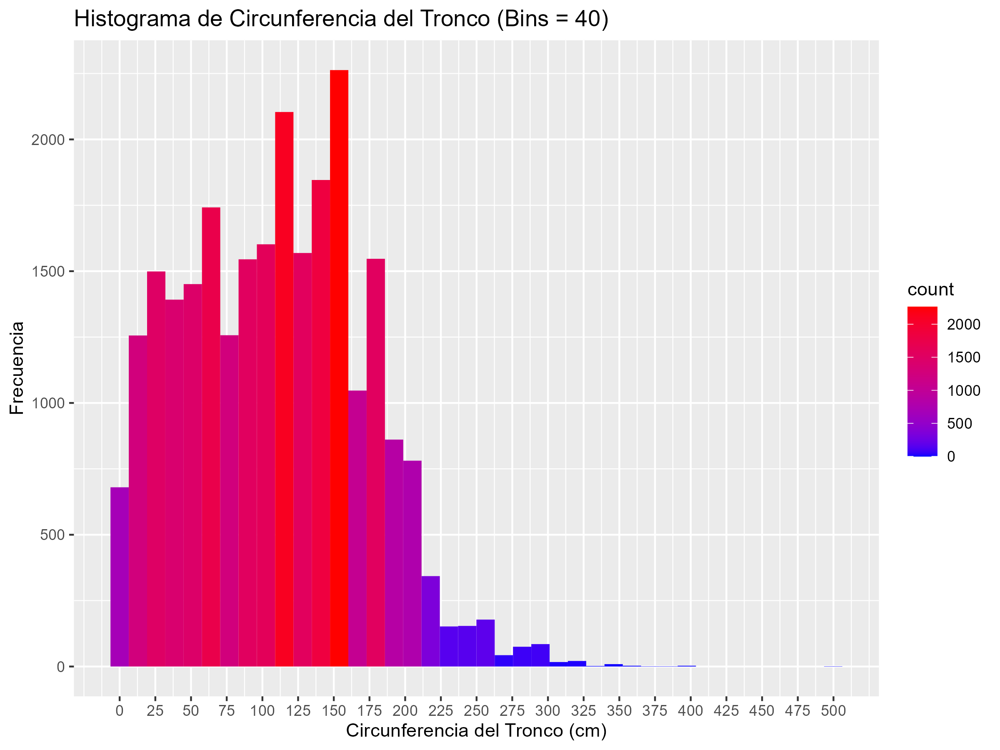

Colocar un archivo con el nombre tp7-eda.md que contenga:
1. ~~Las respuestas a las preguntas del punto 2 junto a sus correspondientes visualizaciones.~~ 
2. Las visualizaciones (histogramas) generadas en el punto 3  
3. Los criterios de corte seleccionados en el punto 3.

# Ejercicio 2
A partir del archivo arbolado-mendoza-dataset-train.csv responder las siguientes preguntas:

## 1. ¿Cuál es la distribución de la clase inclinacion_peligrosa?

La distribución de la clase inclinacion_peligrosa es la siguiente:

    

## 2. ¿Se puede considerar alguna sección más peligrosa que otra?

    

Dónde:
- Sección 1: Parque Central
- Sección 2: Barrio Cívico
- Sección 3: Parque O'Higgins
- Sección 4: 
  - Cuarta Oeste
  - Cuarta Este - Área Fundacional
- Sección 5: Residencial Sur
- Sección 6: Residencial Norte
- Sección 7: Residencial Parque
- Sección 8: Aeroparque
- Sección 11: San Agustín

Considerando el gráfico anterior, las secciones más peligrosas son 3 y 2 en ese orden.

### Separación de sección 4

    

Considerando el gráfico anterior, las secciones más peligrosas son "Parque O'Higgins" y "Barrio Cívico" en ese orden.

## 3. ¿Se puede considerar alguna especie más peligrosa que otra?

    

Considerando el gráfico anterior, las especies más peligrosas son "Algarrobo", "Morera" y "Acacia SP" en ese orden.

# Ejercicio 3

A partir del archivo arbolado-mendoza-dataset-train.csv:

## 1. Generar un histograma de frecuencia para la variable circ_tronco_cm. Probar con diferentes números de bins.

    

    

    

    

    

## 2. Repetir el punto 1) pero separando por la clase de la variable inclinación_peligrosa.

    

    

    

    

    

## 3. Crear una nueva variable categórica de nombre circ_tronco_cm_cat a partir circ_tronco_cm, en donde puedan asignarse solo 4 posibles valores \[muy alto, alto, medio, bajo]. Utilizar la información del punto b para seleccionar los puntos de corte para cada categoría. 

## 4. Guardar el nuevo dataframe bajo el nombre de arbolado-mendoza-dataset-circ_tronco_cm-train.csv
